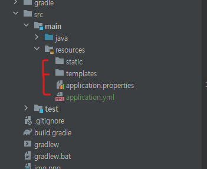

# 스프링 부트3
## 1일차
- 스프링 부트3 프로젝트 만들기
- 공부할 책

- Spring Initializr를 사용한 프로젝트 생성.
- 포스트맨 설치

## 2일차
- 초기 디렉터리 구성

- Test용 Controller, Service, Memeber, Repository 클래스 작성
- Test를 위한 더미데이터를 넣을 SQL 작성
- 포스트맨으로 테스트
- JUnit 테스트